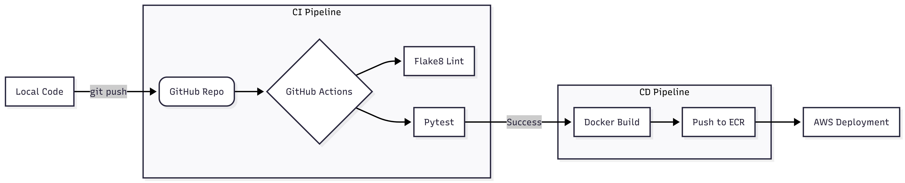

# 🚀 Enterprise CI/CD Pipeline: Python App to Amazon ECR

## 🌟 Overview
This project showcases a professional **CI/CD Pipeline** built with **GitHub Actions**. It automates code quality checks, containerization, and cloud delivery to **AWS**.

## 🗺️ Visual Architecture

## 🏗 Pipeline Architecture (The "DevOps" Flow)
Every time code is pushed to the `main` branch, the following automated steps occur:

* **Linting:** Static code analysis using `Flake8` to maintain high standards.
* **Testing:** Unit tests executed via `Pytest` to ensure code reliability.
* **Dockerization:** Packaging the application into a Docker Image.
* **Cloud Delivery:** Securely pushing the image to **Amazon ECR**.

## 🛠 Tech Stack
* **Automation:** GitHub Actions
* **Cloud Provider:** AWS (IAM, ECR)
* **Containerization:** Docker
* **Quality Control:** Flake8 & Pytest

## 📸 Proof of Concept

---
*Built with ❤️ by Mohamed ELBARGUI*
